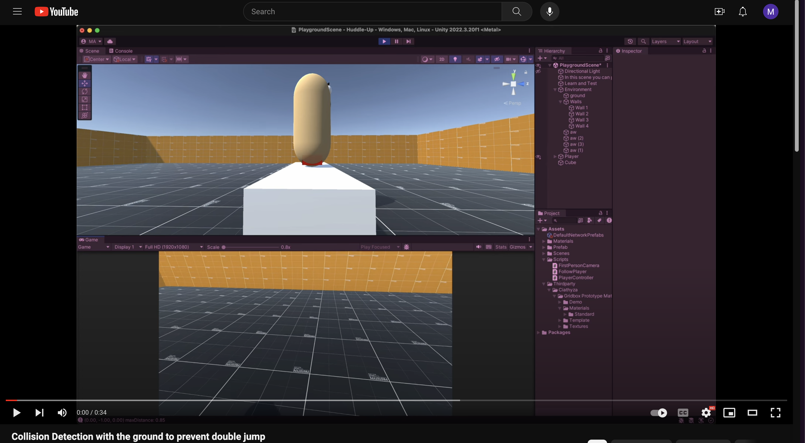
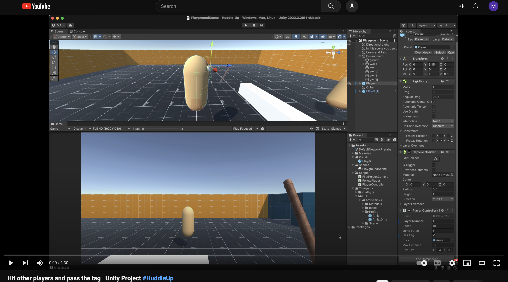

# Huddle-Up 🎮

## TODO
#### High Priority:
- [x] In Game Music
- [x] Sound Effect when the tag is transferred
- [x] Sound Effect when A player hits
- [x] After one game is done, players are taken back to the lobby not to the main menu
- [ ] Players 1-4 can leave the lobby individually

#### Medium Priority:
- [ ] Animation for color picking
- [ ] When a player falls in the Camp map he gets respawned and frozen for a bit
- [ ] The tagger explodes
- [ ] A different animation for the survivor
- [ ] Fix hit animation-delay
##
    

## The Developing journey 📈
### Player grounded - Collision Detection: 📺

### Hit A player and pass the tag: 📺
)

### Capsules in a Tag Swap game: 📺

